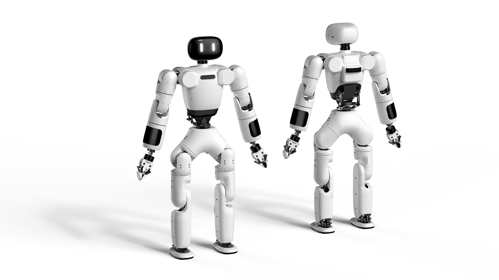

# AgiBot X1 Humanoid Action Control

[中文说明](README.zh_CN.md)

An action-control extension for the AgiBot Lingxi X1 humanoid robot. It retains the original zero, standing, walking, MuJoCo simulation, and DCU/EtherCAT hardware-control pipeline, while adding 16 scripted upper-body and greeting actions.

The project runs on x86-64 Ubuntu 22.04 with ROS 2 Humble, GCC 13, and CMake 3.26+. It uses [AimRT](https://aimrt.org/) as middleware, ONNX Runtime for reinforcement-learning policies, and MuJoCo for simulation.

> **Validation warning:** ROS 2 action triggering and state transitions work, but `wave_forearm` currently makes the robot fall when it starts in MuJoCo. The new actions have **not passed simulation acceptance and must not be deployed to the real robot**. See the [development notes](DEVELOPMENT_NOTES.zh_CN.md#8-当前仿真问题).



## Actions

| Action | ROS 2 topic | Command |
| --- | --- | --- |
| Forearm wave | `/wave_forearm` | `./wave_forearm.sh` |
| Full-arm wave | `/wave_arm` | `./wave_arm.sh` |
| Wrist wave | `/wave_wrist` | `./wave_wrist.sh` |
| Wave and simulated nod | `/greet_nod` | `./run_action.sh greet_nod` |
| Salute | `/salute` | `./run_action.sh salute` |
| Fist-and-palm greeting | `/fist_greeting` | `./run_action.sh fist_greeting` |
| Clap | `/clap` | `./run_action.sh clap` |
| Heart gesture | `/heart` | `./run_action.sh heart` |
| Welcome gesture | `/welcome` | `./run_action.sh welcome` |
| Point left/right | `/point_left`, `/point_right` | `./run_action.sh point_left` |
| Wipe sweat | `/wipe_sweat` | `./run_action.sh wipe_sweat` |
| Scratch head | `/scratch_head` | `./run_action.sh scratch_head` |
| Arm dance | `/arm_dance` | `./run_action.sh arm_dance` |
| Bow and wave | `/bow_wave` | `./run_action.sh bow_wave` |
| Greeting sequence | `/greeting_combo` | `./run_action.sh greeting_combo` |

The robot has no controllable head joint, so `greet_nod` approximates nodding with a small waist-pitch motion. Finger shapes are not controlled; clapping, heart, pointing, and fist-and-palm gestures are approximated with arm poses.

## Architecture

```text
Gamepad or ROS 2 topic
→ AimRT state machine
→ PD or RL controller
→ /joint_cmd
→ MuJoCo SimModule or real-robot DcuDriverModule
```

Actions can only be triggered from `stand`. At action start, the controller captures live joint positions and uses them as the trajectory start and return pose. Ruckig limits velocity, acceleration, and jerk between keyframes.

## Requirements

- Ubuntu 22.04, x86-64
- ROS 2 Humble
- GCC/G++ 13
- CMake 3.26+
- ONNX Runtime
- `libglfw3-dev` and `libdart-external-lodepng-dev`
- A gamepad is optional; mode topics can be published directly with ROS 2

Real-robot operation additionally requires X1 hardware, a correctly configured EtherCAT interface, a real-time Linux environment, a safety frame or suspension system, and a physical emergency stop.

## Build

```bash
cd /home/zhongde/agibot_ws/src/agibot_x1_wave
conda deactivate 2>/dev/null || true
source /opt/ros/humble/setup.bash
source url_gitee.bashrc
./build.sh $DOWNLOAD_FLAGS
chmod +x ./*.sh
```

Rebuild after changing `src/module/**/cfg/`, because runtime configuration is copied to `build/cfg/` during the build.

## MuJoCo simulation without a gamepad

Terminal A:

```bash
cd /home/zhongde/agibot_ws/src/agibot_x1_wave
source /opt/ros/humble/setup.bash
source build/ros2_setup.sh
export LD_LIBRARY_PATH="$PWD/build/install/lib:${LD_LIBRARY_PATH:-}"
cd build
./run_sim.sh
```

The initial state is `idle`, whose PD gains are zero, so the robot may fall at startup. In terminal B, switch to `zero`:

```bash
cd /home/zhongde/agibot_ws/src/agibot_x1_wave
source /opt/ros/humble/setup.bash
source build/ros2_setup.sh
ros2 topic pub --once /zero_mode std_msgs/msg/Float32 '{data: 1.0}'
```

After terminal A reports `Trigger event: [/zero_mode] -> zero`, select **Simulation → Reset** once in MuJoCo, then enter `stand`:

```bash
ros2 topic pub --once /stand_mode std_msgs/msg/Float32 '{data: 1.0}'
```

The required order is:

```text
start simulation → zero → MuJoCo Reset → stand
```

Do not reset after entering `stand`; that can desynchronize simulator and controller state. Once an action has passed safety validation, trigger it and return to stand with:

```bash
./wave_forearm.sh
./return_to_stand.sh
```

At present, stop before this step unless actively diagnosing the known falling issue.

## Real robot

Do not run the new actions on hardware until they pass repeated MuJoCo tests without falls, self-collision, abrupt motion, or control errors. The base hardware pipeline starts with:

```bash
cd /home/zhongde/agibot_ws/src/agibot_x1_wave
source /opt/ros/humble/setup.bash
source build/ros2_setup.sh
cd build
./run.sh
```

Verify the EtherCAT interface in `src/module/dcu_driver_module/cfg/dcu_x1.yaml` before startup. Never use `/stand_mode` as a replacement for the physical emergency stop.

## Project layout

```text
src/module/control_module/                   State machine and PD/RL control
src/module/control_module/cfg/rl_x1.yaml     Hardware configuration
src/module/control_module/cfg/rl_x1_sim.yaml Simulation configuration
src/module/sim_module/                       MuJoCo simulator and model
src/module/dcu_driver_module/                DCU/EtherCAT driver
src/module/joy_stick_module/                 Gamepad input
run_action.sh                                Unified action entry point
WAVE_GUIDE.zh_CN.md                          Action and safety guide
DEVELOPMENT_NOTES.zh_CN.md                   Development notes
```

The local `build/` directory contains large generated artifacts and must not be committed.

## Documentation

- [Chinese README](README.zh_CN.md)
- [Action and safety guide](WAVE_GUIDE.zh_CN.md)
- [Development notes](DEVELOPMENT_NOTES.zh_CN.md)
- [Original X1 tutorials](doc/tutorials.md)
- [Joystick module](doc/joy_stick_module/joy_stick_module.md)
- [DCU driver module](doc/dcu_driver_module/dcu_driver_module.md)
- [RL control module](doc/rl_control_module/rl_control_module.md)

## Safety

- Test every action repeatedly in MuJoCo before hardware deployment.
- Use a safety frame or suspension system for initial hardware tests.
- Keep another operator on the physical emergency stop.
- Stop on oscillation, unexpected noise, abrupt motion, loss of balance, tracking errors, or DCU disconnection.
- Do not increase hardware joint limits, speed, acceleration, jerk, or PD gains without a new simulation-validation cycle.
- Inspect near-head and two-arm actions frame by frame for self-collision.

## License

This research project runs on [AimRT](https://aimrt.org/) and is distributed under the [Mulan PSL v2](LICENSE.txt), without warranty of fitness for a particular purpose.
